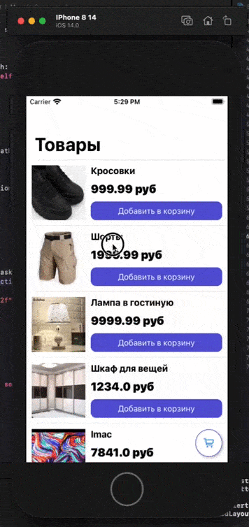

# Тестовое задание на интернет-магазин

Задание звучало следующим образом: 

> Приложение из двух экранов. Первый экран это список карточек с товарами (иконка, название, цена, кнопка "Добавить в корзину") + кнопка типа FAB с иконкой корзины и счетчиком товаров внутри корзины, по нажатию на кнопку происходит переход на второй экран. Второй экран - список таких же карточек товаров в корзине, только вместо кнопки добавления в корзину, счетчик количества (включая кнопки +/-) и кнопка удаления товара из корзины + внизу экрана должна быть итоговая цена и кнопка "Сделать заказ" по нажатию на неë появляется алерт с всей корзиной в JSON формате.

Для выполнения задания я выбрал архитектуру MVP, вначале была мысль использовать VIPER, но в итоге выбрал MVP, так как не было много времени на решение тестового. Кодогенерацию подключать не хотелось.

BasketService - был написан, для дальнейшей его подмены на какой-либо другой Service, CoreData или Networking, Например

Результат работы приложения

